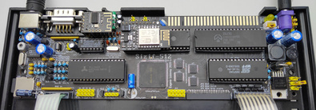
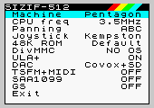

## Sizif-512
Another CPLD-based ZX Spectrum clone for 48K rubber case with some sweet features.

### Tech specs
* Half-sized PCB for 48K rubber case
* Pentagon, Spectrum 128, Spectrum 48 and Spectrum +3e modes
* Altera EPM1270 CPLD
* Real Z80 in 3.5MHz, 4.4MHz, 5.2MHz, 7MHz (no-wait turbo) and 14MHz (turbo with wait-states) modes
* 512K RAM
* Real AY-3-8910 with switchable stereo ABC/ACB/mono output
* Sega 6-button joystick input; Kempston/Sinclair modes
* Integrated DivMMC and Z-Controller, 1x microSD socket
* PAL and RGB video output (Sega Mini-DIN/9 connector)
* Digital video output header for EGA monitors, VGA scandoublers, etc.
* ULAplus
* Mono covox (Pentagon standard)
* SounDrive (4-channel stereo covox)
* WiFi addon ([link](https://github.com/UzixLS/zx-sizif-512-wifi))
* Tape input via 3.5" jack and Bluetooth
* 9-12V power supply with any polarity
* Reset and Magic buttons; header for power button

With extension board ([link](https://github.com/UzixLS/zx-sizif-512-ext)) more features may be added:
* Turbo Sound FM
* General Sound (12MHz / 512Kb RAM)
* SAA1099
* MIDI sound

### Demonstration
Running Pentagon and Spectrum 128 demos: [link](https://www.youtube.com/watch?v=_RoLKcfJSTY)
Playing music from SD: [link](https://www.youtube.com/watch?v=TmikKD3yqOU)
Some random photos: [link](https://cloud.err200.net/index.php/s/73TR85tYZkMm8Ax?path=%2Fsizif-512)

Review by Martin's 8-bit blog (in czech): [link](https://www.8bity.cz/2020/zx-spectrum-clone-with-cpld-ulaplus-sizif-512/#)
Review by The Retro Shack youtube channel: [link](https://www.youtube.com/watch?v=l5IgQTgq_bg)
Building from scratch experience in Terence Ang's blog: [part1](https://www.terenceang.com/2021/08/28/building-a-zx-spectrum-clone-in-2021-begining/) [part2](https://www.terenceang.com/2021/08/29/building-a-zx-spectrum-clone-in-2021-sourcing-for-parts/) [part3](https://www.terenceang.com/2021/08/31/building-a-zx-spectrum-clone-in-2021-populating-the-board/)

### Magic button
Sizif has a number of configurable parameters that you can change on the fly. To do this just hold Magic button for a second.

To navigate menu you can use up-down keys, to change value use enter or left-right keys. Kempston, Sinclair, Cursor and QAOP supported.

If you press Magic button for a short time, the standard NMI handler 'll be called.

### Sega gamepad buttons
Sega gamepad support will be available starting from PCB rev.D (or Rev.C with slight modifications).
| Button | Function in Kempston mode | Function in Sinclair mode |
| - | - | - |
| Up | Up | 9 |
| Down | Down | 8 |
| Left | Left | 6 |
| Right | Right | 7 |
| A | Button 3 | N |
| B | Button 1 | 0 |
| C | Button 2 | M |
| X | Turbo Button 3 | Turbo N |
| Y | Turbo Button 1 | Turbo 0 |
| Z | Turbo Button 2 | Turbo M |
| Start | Pause | Pause |
| Mode | Magic button | Magic button |

### PS/2 keyboard buttons
| Button | Function |
| - | - |
| F1 | Pause |
| F5 | Magic button |
| F10 | Reboot |
| F12 | Reboot |
| Ctrl+Alt+Del | Reboot |
| Ctrl+Alt+Backspace | Reboot |
| Numpad 8, 2/5, 4, 6 | Joystick's up-down-left-right |
| Numpad 0/Enter | Joystick's fire |
| Alt | Joystick's fire |

### RAM
Sizif contains 512K RAM. There are two cases how to access it:
1. DivMMC enabled (SD card insert) - 128K available via 7FFDh port, 128K via DFFDh (Profi standart, most compatible with old 128K software) and 128K reserved for DivMMC.
2. No SD card present - 128K available via 7FFDh and 384K via DFFDh. Please note: ULAplus and Magic button shares one page of memory with DFFD port. If you run 512K-software, it's good idea not to use ULAplus and Magic.

Note that DFFDh port available only in Pentagon mode.

### SD card
Sizif have preinstalled esxDOS firmware, which provides ability to load TAP, TRD, SCL, Z80 files and save snapshots. To use this you should format SD cart to FAT32 or FAT16 and unpack latest esxDOS release ([link](http://www.esxdos.org/index.html)) to card. Also it's recommended to install Long Filename Browser ([link](https://spectrumcomputing.co.uk/forums/viewtopic.php?t=2553)) to card.

### Tested addons
* [AYX-32](https://github.com/tslabs/arm/tree/master/AYX-32) - OK
* BDI-ZX ver 2.0 MVcomp FDD interface - OK
* [ZX Dandanator! Mini 2.1](http://www.dandare.es/Proyectos_Dandare/ZX_Dandanator%21_Mini_EN.html) - OK
* [ZX TSid](https://github.com/UzixLS/zx-tsid) - OK
* [Multiface 128 1.00 by Steve Smith](http://projectspeccy.com/projects/) - OK (if SD card isn't insert)
* Noname +3DOS floppy controller - OK (since rev.D)
* [PLUS 2A FDD Interface](https://github.com/konkotgit/PLUS-2A-FDD) - OK (since rev.D)
* DivIDE 5.7d - OK (if SD card isn't insert)
* DMA 2.02 by ShamaZX - OK
* [Kempston + TurboSound interface](https://github.com/konkotgit/KTS) - OK
* [ZX-HD](https://www.bytedelight.com/?page_id=1800) - OK
* [ZX-VGA-JOY](http://zx-vga-joy.com/) - OK
* [Spectranet by ByteDelight](https://www.bytedelight.com/?page_id=3515) - OK
* Spectranet by ShamaZX (aka ZX Net 512) - OK

### Changelog & current status
* Rev.A - first release. Please note the [errata](pcb/rev.A/ERRATA.ru.txt) (in russian).
* Rev.B - abandoned. Files kept for historical reason.
* Rev.C - BDI has been removed; improved video circuit; more capable CPLD; better power circuit; add mono AY mode. [Errata](pcb/rev.C/ERRATA.txt).
* Rev.C1 - fixed incorrect JTAG pinout; fixed incorrect silkscreen for power connector J3, tuned some circuit values. Everything seems to work. [Errata](pcb/rev.C1/ERRATA.txt).
* Rev.D:
    * added zxbus connector for in-case addons
    * added support for +3DOS floppy controller
    * added support for Sega 3/6-button gamepad
    * added PS/2
    * added Bluetooth tape input (via M18 module)
    * added alternative microSD card socket footprint
    * fixed compatibility with some keyboards
    * modified tape input circuit
* Rev.D1: minor changes in pcb layout
* Rev.E:
    * added fuse on power input
    * added protection diode on 5V power rail
    * rotated left keyboard connector by 180 degrees
    * replaced TRS audio connectors by TRRS with video output
    * changed C37,C38,C39 footprint to able to install film capacitors
    * improved compatibility with wireless sega gamepads - 3.3V power replaced by 5V
    * added ability to simultaneously install the power/reset keys together with the connectors
    * added jumper for wiring minidin-9 pin 4 with composite or sync output for compatibility with dirty scart cables
    * added ability to install full-height 4.43MHz crystal
    * all 0.5/0.3 vias replaced by 0.6/0.3
    * experimental: 74HCU04-based speaker amplifier replaced by LM386-based
    * experimental: 74HCU04-based tape input circuit replaced by LM311-based
    * experimental: 74HCU04-based crystal clock generator replaced by ICS501-based
* Rev.E1:
    * reverted experimental rev.E changes

### Acknowledgments
This work is inspired and based on a lot of other projects and would hardly have been successful without them:
* Harlequin ([link](https://www.facebook.com/groups/349470902442395/))
* Karabas-128 ([link](https://github.com/andykarpov/karabas-128))
* ZX Evolution ([link](http://nedopc.com/zxevo/zxevo.php))
* zx_ula verilog implementation ([link](https://opencores.org/projects/zx_ula))
